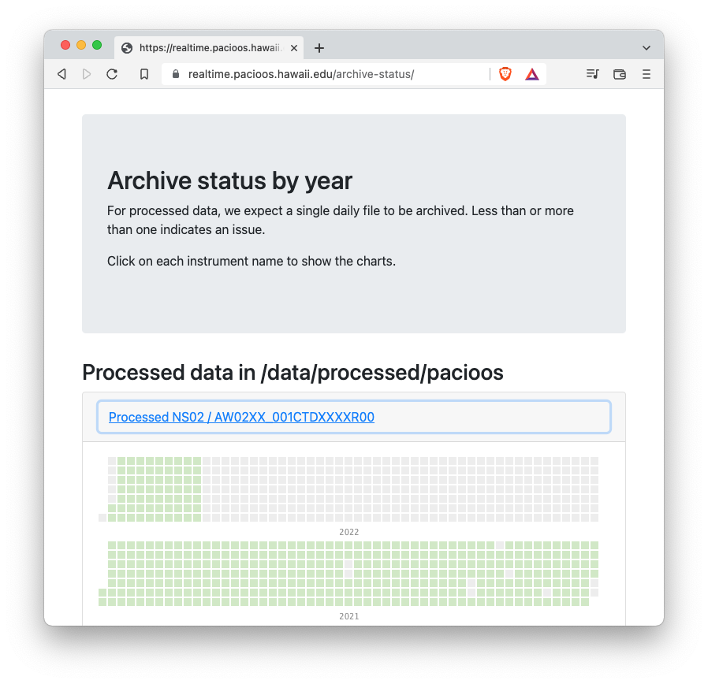

# PacIOOS Archive Status Page

This repository contains code to render the daily status of the nearshore instrument archive found on https://realtime.pacioos.hawaii.edu.  The code has two simple components:

- A server-side python process that generates JSON files for each instrument and each year.  For each day of the year, the JSON file lists the number of files archived.

- A web page with a Javascript module that renders each JSON object as a Calendar Heatmap

The python `archive-status.CalendarHeatmapReporter` gets executed via `crontab` every 2 hours to update the JSON files

## Installation
The python code is manually installed in `/home/kilonalu/archive-status`, and the web components are manually installed into `/var/www/realtime.pacioos.hawaii.edu/archive-status`. If it isn't present already, create the logging directory and file and allow the `kilonalu` user write access.

```bash
sudo mkdir -p /var/log/pacioos/archive-status
sudo touch /var/log/pacioos/archive-status/archive-status.log
sudo chown -R kilonalu:kilonalu /var/log/pacioos/archive-status
```

Lastly, ensure there is a crontab entry for the `kilonalu` user that executes the reporter:

```cron
5 */2 * * * python3 /home/kilonalu/archive-status/archive-status.py
```



## Acknowledgments

With gratitude, this repository uses the following open source projects:

- [Bootstrap](https://getbootstrap.com/)
- [Cal-Heatmap](https://cal-heatmap.com/)
- [D3](https://d3js.org/)
- [MomentJS](https://momentjs.com/)
